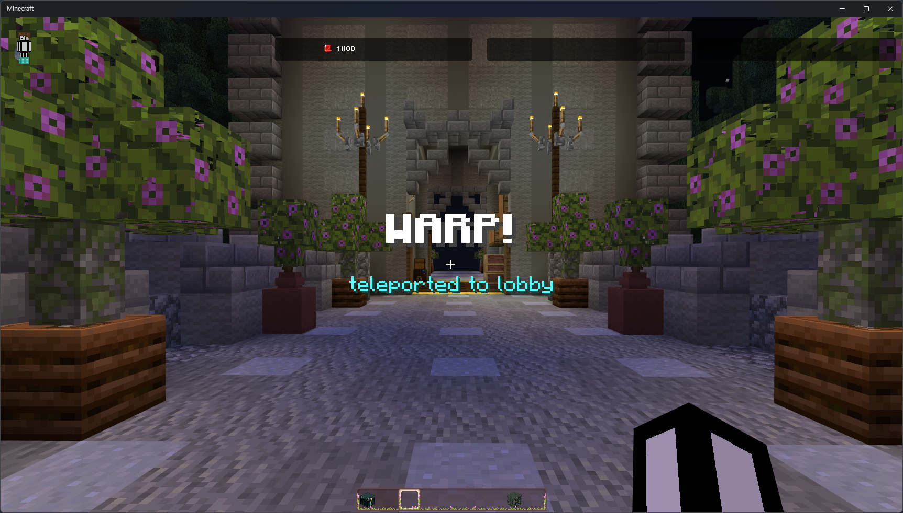

# ✈️ WarpCore
> Warp System. (plugin for PocketMine-MP 5)



## Feature
- You can add custom warps and players can use those warps!
- If you created a warp named 'lobby', players can use it through a short command '/lobby'.
- available two languages (english, korean) - Please correct any errors through contributions!
- developer API ([Use cases](https://github.com/RICHMCBE/NewbieWarp))

## How to Use:
1. Put WarpCore in your plugin folder.
2. Turn on PocketMine-MP and turn off.
3. Open `config.yml` file in plugin data folder.
4. Start the server.

## Command

| name         | description                        | usage         | permission          |
|--------------|------------------------------------|---------------|---------------------|
| warp         | use a warp named (name)            | /warp (name)  | warpcore.use.warp   |
| (warp's name) | use a warp (short command)         | /(warp's name) | warpcore.use.warp   |
| warpmanager  | manage warps(create, remove, edit) | /warpmanager  | warpcore.manage.warp |

## permissions

| name                 | default     |
|----------------------|-------------|
| warpcore.use.warp    | All players |
| warpcore.manage.warp | operators   |


## API

Get a warp
```php
use RoMo\WarpCore\warp\WarpFactory;

//get a one warp
WarpFactory::getInstance()->getWarp(string $name);

//get all warps
WarpFactory::getInstance()->getAllWarp();
```

Warp method
```php
use RoMo\WarpCore\warp\WarpFactory;
use pocketmine\math\Vector3;
use pocketmine\player\Player;

$warp = WarpFactory::getInstance()->getWarp(string $name);

//Getter & Setter
//warp name
$warp->getName() : string;

//warp location information
$warp->getWorldName() : string;
$warp->getPosition() : Vector3;
$warp->getYaw() : float;
$warp->getPitch() : float;

//is a warp send title
$warp->isTitle() : bool;
$warp->setIsTitle(bool $isTitle) : void;

//is a warp send particle
$warp->isParticle() : bool;
$warp->setIsParticle(bool $isParticle) : void;

//is a warp send sound
$warp->isSound() : bool;
$warp->setIsSound(bool $isSound) : void;

//is a warp able to be used by users
$warp->isPermit() : bool;
$warp->setIsPermit(bool $isPermit) : void;

//does a warp register a command(warp command, short command)
$warp->isCommandRegister() : bool;
$warp->setIsCommandRegister(bool $isCommandRegister) : void;

//Teleport a player to this warp
//$targetVisual is targets that receive particle packet
//$targetSound is targets that receive sound packet
$warp->teleport(Player $player, array $targetVisual = null, array $targetSound = null) : void;
```


